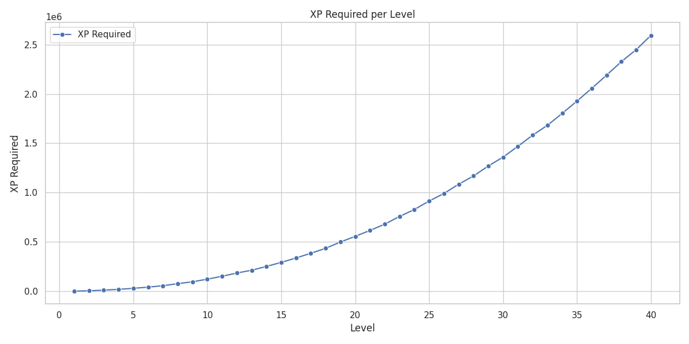

# Comprehensive Article on Dynast.io Bot XP Ranking System
## Dynast.io Bot XP Ranking System

Overview
Welcome to the documentation for the Discord Bot XP Ranking System, a modular, community-driven feature designed to enhance engagement in your Discord server through experience points (XP) and level progression. This README.md aims to provide a comprehensive guide for users, administrators, and developers. You'll learn how the XP system works, how to configure levels and rewards, and how to leverage best practices for structuring and visualizing your Discord bot documentation on GitHub. We also include a Markdown table generated from level_xp_table.csv, detailed placeholder image instructions, code logic explanations, and a comparison with established solutions like MEE6 and Tatsu.

Whether you're a server owner seeking to incentivize participation or a developer looking to customize an XP and leveling system, this guide will walk you through the full functionality, usage, extensibility, and rationale behind every feature.


## 📈 Level Progression System
This repository contains a comprehensive breakdown of a level-based XP system designed to track user progression through experience points (XP). Whether you're building a gamified app, a chatbot reward system, or a learning platform, this model offers a scalable and intuitive way to measure user engagement.


## 🚀 Overview
The system is based on a simple principle: users earn XP through interactions (e.g., sending messages), and as they accumulate XP, they level up. Each level requires more XP than the previous one, encouraging continued participation and rewarding long-term engagement.

- **XP per message**: 60 XP  
- **Levels supported**: 1 to 40  
- **XP increases linearly**: Each level requires 60 more XP than the previous one  
- **Cumulative XP**: Total XP needed to reach a given level  
- **Messages per level**: Estimated number of messages needed to reach each level

---

## ✨ Key Features
- Automated XP allocation based on user activity (messages and optionally voice)
- Level progression with exponential or table-based XP thresholds
- Customizable XP gain, cooldowns, and anti-spam protection
- Automated assignment and removal of reward roles at key level milestones
- Channel/role restrictions (blacklisting/whitelisting for XP)
- Configurable level-up announcements
- Intuitive commands for checking XP, levels, and leaderboards
- Reliable, maintainable, and modular code following Discord and community safety guidelines


# 1. Introduction to XP Systems in Discord
XP (experience points) systems are popular community engagement tools within Discord servers. They reward members for their participation, providing incentives such as cosmetic roles, reputation, or access to exclusive features. XP and leveling systems are fundamentally gamification mechanisms, often seen in gaming and learning contexts, designed to boost user retention, healthy competition, and consistent activity.

Discord XP systems are most frequently implemented via bots—either as part of multi-purpose utility bots or as dedicated "leveling" plugins. They automate XP tracking, level calculation, role assignment, and typically include commands for leaderboard and profile display.

## Why Use an XP/Level System ?
- Boosts activity – Encourages users to chat and participate, maintaining a lively server.
- Reward structure – Publicly recognizes active users using levels/roles.
- Customizable incentives – Lets admins configure meaningful in-server rewards (special roles, permissions, badges).
- Security tool – Advanced systems can restrict server features or permissions to certain trust levels, helping filter out troublemakers.


## Types of XP Systems
XP systems can be:

- Cyclical: XP resets on a regular schedule, encouraging new blood to rise to the top.
- Permanent: XP persists indefinitely, showcasing all-time dedication.
- Combined: Hybrid systems maintain both cyclical and permanent leaderboards for diverse rewards and social dynamics.
- Caveat: Any system that quantifies participation can be gamed or abused; built-in anti-spam, moderation, and proper announcement management are essential.

---

# 2. How the Discord Bot XP System Works
XP Allocation
- Text-based Activity: Each message grants a pre-defined, often randomized amount of XP (e.g., 4–25 XP).
- Voice-based Activity (Optional): XP may be awarded based on time spent talking in voice channels.(we don't support this)
- Cooldowns: Cooldowns between XP gains per user (e.g., 30 seconds or 1 minute) limit farming and reduce spam incentive.
Caveat: Any system that quantifies participation can be gamed or abused; built-in anti-spam, moderation, and proper announcement management are essential.


Example logic:

```python
if message.author.id in message_cooldown:
    if time.time() - message_cooldown[message.author.id] < 1.5:
        return  # Too soon; no XP awarded
# Proceed with awarding XP, updating last message time
message_cooldown[message.author.id] = time.time()
This prevents users from spamming messages to “farm” XP by enforcing a minimum interval between XP-eligible actions.
```
This prevents users from spamming messages to “farm” XP by enforcing a minimum interval between XP-eligible actions.

## Level Calculation
- The level is calculated based on total accumulated XP, following a mathematical formula (commonly exponential for increased progression difficulty) or via a lookup table.
- Popular formula: level = int(experience ** (1/4))
- - To find next-level XP requirement: next_level_xp = (current_level + 1) ** 4
- - XP to next level: missing_exp = next_level_xp - current_exp
- Some bots use more complex or customized formulas, or even load thresholds from a CSV file.


## Role Rewards
When a user reaches a certain level, the bot can automatically assign them Discord roles. These roles can:
- Serve purely as a cosmetic badge of honor
- Grant additional permissions/abilities (access to channels, posting media, etc.)
- Be awarded cumulatively (“stacked”) or have only the highest unlocked role active (“replace previous reward”)
- Be removed if a user loses XP (e.g. moderation, cyclical reset)
Role rewards are fully customizable via bot config or admin commands.


## Anti-Spam and Abuse Protection
- Message cooldown: Only messages sent after the cooldown gain XP.
- No-XP roles/channels: Exclude certain users (e.g., bots, abusers, or by request) and channels (e.g., #spam, #bots) from earning XP.
- XP adjustment commands: Let admins add/remove/reset users' XP as needed for moderation or recovery.

---

# 3. XP Calculation and Level Progression Logic

## Exponential vs. Linear Progression
Most modern Discord XP bots use an exponential formula to escalate the XP required per level. This keeps early progress quick to increase initial motivation while adding long-term challenge for more dedicated users.

Standard Formula Example
```python
# Level calculation
level = int(experience ** (1/4))
# To calculate required XP for next level
next_level_xp = (current_level + 1) ** 4
xp_to_next_level = next_level_xp - current_experience
This creates a steep, but manageable, “grind curve”:
```
`
Level 1 → 2: 60 XP
Level 2 → 3: 120 XP
Level 3 → 4: 180 XP
Level 4 → 5: 240 XP
Level 5 → 6: 300 XP
`

---


# 4. System Architecture & Code Explanation
## Core Data Structures
- User Data Storage: Typically a JSON file, SQLite database, or a cloud-backed document (user ID, current XP, level, last message time)
- Role and Level Configs: Mapping of level thresholds to Discord role IDs/names/permissions

Code Example: Awarding XP with Cooldown
```python
message_cooldown = {}

@bot.event
async def on_message(message):
    if message.author.bot:
        return
    current_time = time.time()
    if message.author.id in message_cooldown:
        if current_time - message_cooldown[message.author.id] < 1.5:
            # Cooldown not yet expired; ignore for XP
            return
    with open('level.json', 'r', encoding='utf-8') as f:
        users = json.load(f)
    await update_data(users, message.author, message.guild)
    await add_experience(users, message.author, 4, message.guild)
    await level_up(users, message.author, message.channel, message.guild)
    message_cooldown[message.author.id] = current_time
    with open('level.json', 'w', encoding='utf-8') as f:
        json.dump(users, f)
    await bot.process_commands(message)
```

This canonical snippet demonstrates how to:

- Avoid granting XP to bots
- Impose a per-user cooldown
- Safely update experience
- Persist updated data per message


## Level-Up Event Logic
```python
async def level_up(users, user, channel, guild):
    experience = users[str(guild.id)][str(user.id)]['experience']
    lvl_start = users[str(guild.id)][str(user.id)]['level']
    lvl_end = int(experience ** (1/4))
    if lvl_end > lvl_start:
        await channel.send(f":fire: {user.mention} has leveled up to **Level {lvl_end}!**")
        users[str(guild.id)][str(user.id)]['level'] = lvl_end
```
- Detects when a user’s XP is sufficient for a new level (via mathematical root)
- Handles multi-level jumps in a single message
- Announces the level-up using Discord embed or raw message
- Updates internal state for persistent tracking

## Role Assignment Logic
Assigning roles requires mapping a user’s new level to the correct Discord role. In discord.py, you can do:

``` python
if users[str(user.id)]['level'] == 5:
    role = user.guild.get_role(ROLE_ID)
    if role is not None:
        await user.add_roles(role)
```

- Check if user has reached a milestone level
- Fetch the role object and add it to the user atomically
- Optionally, remove previous role(s) if desired


## Level-up Announcements
- Options include:
- In-channel (user’s current channel)
- DM (direct message to user)
- Custom (specified leveling log channel)
- Silent (disabled for privacy)

Admins should balance celebratory visibility with spam/notification fatigue.

---

## 🖼️ Visualizations

### XP Required per Level



---


